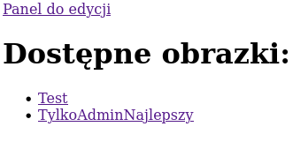
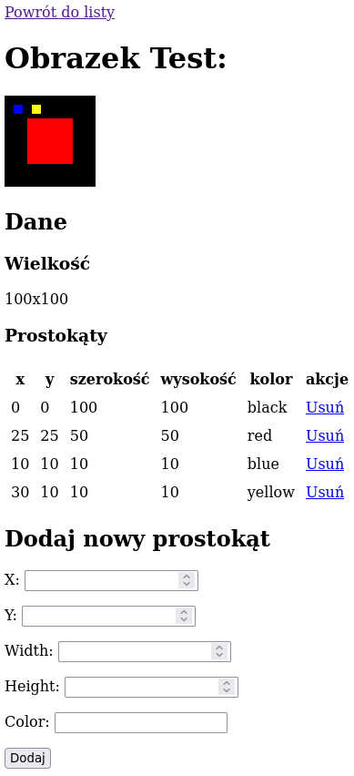
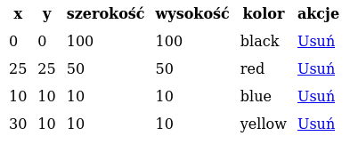
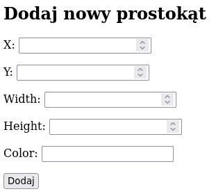
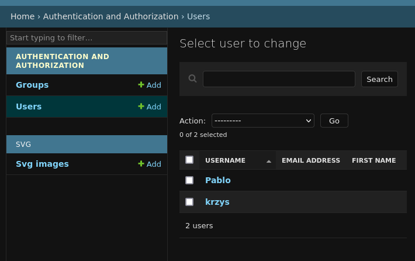
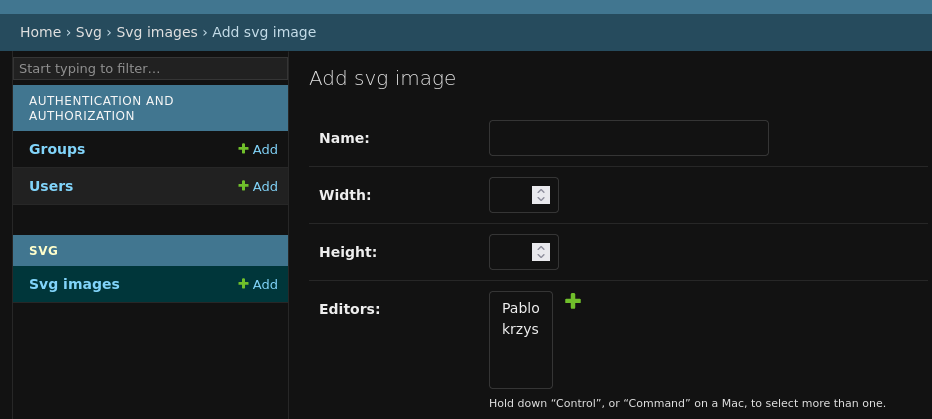

# Zadanie

W tym zadaniu należy przygotować
serwis internetowy do przeglądania i publikacji **obrazków**.

Obrazek to grafika w formacie SVG, która składa się z dowolnej ilości dowolnych prostokątów (mogą różnić się położeniem, wielkości i kolorem wypełnienia).

### Przykładowy kod poprawnego obrazka

```svg
<svg width="100" height="100" viewBox="0 0 100 100" version="1.1" xmlns="http://www.w3.org/2000/svg">
    <rect x="0" y="0" width="100" height="100" fill="black"></rect>
    <rect x="25" y="25" width="50" height="50" fill="red"></rect>
    <rect x="10" y="10" width="10" height="10" fill="blue"></rect>
</svg>
```

## Użytkownicy

Z serwisu korzystają trzy typy użytkowników:

1. zwykły użytkownik
1. artysta (użytkownik z kontem)
1. administrator serwisu (użytkownik z kontem administracyjnym)

Każdy kolejny typ ściśle rozszerza dostępne w ramach serwisu akcje poprzedniego typu.

### Zwykły użytkownik

Po wejściu na stronę serwisu może:

- zobaczyć listę wszystkich opublikowanych obrazków
  
  
- wybrać obrazek i zobaczyć jego podgląd bezpośrednio w przeglądarce
  
  

### Artysta

Może zalogować się do serwisu korzystając z konta utworzonego dla niego przez administratora strony.
Ponad to co może zrobić zwykły użytkownik, artysta
może **edytować** obrazki, które są mu przypisane przez administratora strony.



Edycja oznacza, że może on przerobić dowolny obrazek na dowolny inny.
Najbardziej minimalistyczna wersja spełnienia tego wymagania to implementacja dwóch akcji:
- usunięcie wszystkich prostokątów z obrazka (poniżej każdy prostokąt można usunąć z osobna)
  
  
- dodanie dowolnego prostokąta na koniec obrazka (tzn. wyświetlającego się na wierzchu)
  
  

### Administrator strony

Jako jedyny ma dostęp do admin panelu django,
skąd może:

- zarządzać kontami dla artystów
  
  
- tworzyć nowe obrazki i przypisywać je do edycji artystom
  
  
- modyfikować wielkość obrazków

## Uwagi

Serwis należy zaimplementować z użyciem framework'a django.

Materiał prawie wystarczający do wykonania zadania jest zawarty w trzech pierwszych częściach oficjalnego tutorial'a django:

- [podstawowy setup projektu](https://docs.djangoproject.com/en/5.0/intro/tutorial01/)
- [modele](https://docs.djangoproject.com/en/5.0/intro/tutorial02/)
- [templaty](https://docs.djangoproject.com/en/5.0/intro/tutorial03/)

Zrozumienie generycznych widoków z [tutorial'a czwartego](https://docs.djangoproject.com/en/5.0/intro/tutorial04/) może uprzyjemnić i uprościć pracę, choć czasem wymaga znalezienia jakiegoś magicznego atrybutu celem uzyskania tego co się akurat chce (copilot / chatgpt jest w tym całkiem niezły).

Istotą zadania jest zapewnienie użytkownikowi każdego typu opisanych powyżej funkcjonalności. Rozkład dostępnych akcji na poszczególnych stronach nie musi być taki jak na załączonych zrzutach ekranu. Dodatkowo wygląd strony również nie jest ważny.

Nawigacja po serwisie powinna być możliwa jedynie z użyciem linków dostępnych na poszczególnych stronach (bez posługiwania się paskiem przeglądarki).

Do logowania i wylogowywania artystów można użyć intefejsu zapewnionego przez panel administracyjny django.
W takim wypadku powinni oni mieć ustawioną flage staff member, ale nie mogą mieć uprawnień do edycji niczego z użyciem admin panelu.

Nie trzeba zabezpieczać się przed atakami w stylu: preparuję jakimś zewnętrznym narzędziem żądanie http, które wysłałby inny użytkownik celem modyfikacji jego obrazka. Wystarczy, że taka niechciana akcja nie będzie jawnie dostępna na stronie. Niemniej warto pomyśleć, w których miejscach strony może to stanowić potencjalne zagrożenie.